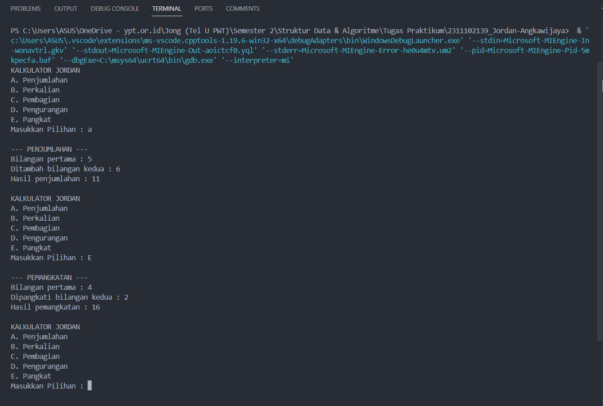
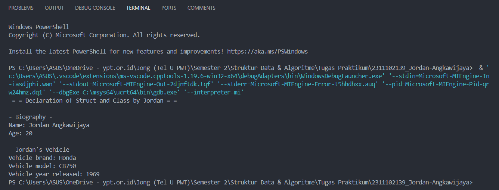
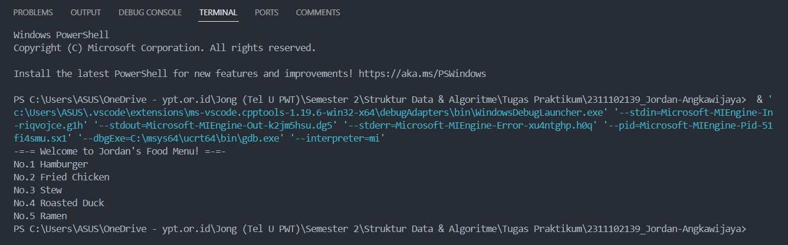

# <h1 align="center">Laporan Praktikum Modul 1 - Tipe Data</h1>
<p align="center">Jordan Angkawijaya - 2311102139</p>

## Dasar Teori

Tipe data adalah suatu memori atau media pada komputer yang digunakan untuk menampung informasi atau data sementara. Tipe data berfungsi untuk mempresentasikan jenis dari sebuah nilai yang terdapat dalam program. Berikut ini merupakan macam-macam tipe data serta penjelasannya yang terdapat pada C++:

1. Tipe Data Primitif<br/>
Tipe data primitif adalah tipe data yang sudah ditentukan oleh sistem dan disediakan oleh banyak bahasa pemrograman. Ini adalah blok bangunan fundamental untuk menyimpan nilai-nilai sederhana. Contoh tipe data primitif:
    - Int (Bilangan bulat)
    - Float (Bilangan desimal)
    - Char (Huruf)
    - Boolean (True/False)

2. Tipe Data Abstrak<br/>
Tipe data abstrak atau yang biasa disebut Abstrak Data Type merupakan tipe data yang dibentuk oleh programmer itu sendiri. Pada tipe data abstrak bisa berisi banyak tipe data, jadi nilainya bisa lebih dari satu dan beragam tipe data

3. Tipe Data Koleksi<br/>
Tipe data koleksi (Collection Data Type) adalah tipe data yang digunakan untuk mengelompokkan dan menyimpan beberapa nilai atau objek secara bersamaan. Tipe data koleksi memungkinkan Anda menyimpan, mengelola, dan mengakses sejumlah besar data dengan cara yang terstruktur. Contoh data koleksi:
    - Array (struktur data statis yang menyimpan elemen-elemen dengan
    tipe data yang sama)
    - Vector (vector mirip seperti array yang memiliki
    kemampuan untuk menyimpan data dalam bentuk elemen-elemen yang alokasi
    memorinya dilakukan otomatis dan bersebelahan)
    - Map (Map terasa mirip dengan array namun dengan index yang memungkinkan
    untuk berupa tipe data selain integer)

## Guided 

### 1. Tipe Data Primitif

```C++
#include <iostream>
#include <iomanip>

using namespace std;

// Tipe Data Primitif by Jordan

int main(){
    char op;
    float num1, num2;

    cout << "Enter operator (+, -, *, /): ";
    cin >> op;

    cout << "Enter two operands: ";
    cin >> num1 >> num2;

    switch (op)
    {
    case '+':
        cout << "Result: " << num1 + num2 << endl;
        break;
    case '-':
        cout << "Result: " << num1 - num2 << endl;
        break;
    case '*':
        cout << "Result: " << num1 * num2 << endl;
        break;
    case '/':
        if (num2 == 0) {
            cout << "Result: " << fixed << setprecision(2) << num1 / num2 << endl;
        } else {
            cout << "Error!: Division by zero" << endl;
        }
        break;

    default:
        cout << "Error! operator is not correct" << endl;
        break;
    }
    return 0;
}
```
Kode di atas digunakan untuk memilih operasi penambahan (+), pengurangan (-), perkalian (*), dan pembagian (/). Keempat operasi ini akan jalan jika user sudah menginput dua angka pada saat penginputan cin. Terdapat juga dua tipe data primitif pada program ini, yaitu char dan float. Tipe data char digunakan pada saat pemilihan switch case dan float digunakan sebagai tipe data 2 angka yang diinput user.

### 2. Tipe Data Abstrak

```C++
#include <stdio.h>
#include <string.h>

// Struct
struct Mahasiswa
{
    char name[50];
    char address[50];
    int age;
};

// Tipe Data Abstrak by Jordan

int main() {
    // Menggunakan Struct
    struct Mahasiswa mhs1, mhs2;

    // Mengisi nilai ke struct
    strcpy(mhs1.name, "Dian");
    strcpy(mhs1.address, "Mataram");
    mhs1.age = 22;
    strcpy(mhs2.name, "Bambang");
    strcpy(mhs2.address, "Surabaya");
    mhs2.age = 23;

    // Mencetak isi dari struct
    printf("## Mahasiswa 1 ##\n");
    printf("Nama: %s\n", mhs1.name);
    printf("Alamat: %s\n", mhs1.address);
    printf("Umur: %d\n", mhs1.age);
    printf("\n");
    printf("## Mahasiswa 2 ##\n");
    printf("Nama: %s\n", mhs2.name);
    printf("Alamat: %s\n", mhs2.address);
    printf("Umur: %d\n", mhs2.age);

    return 0;
}
```
Kode di atas digunakan untuk mencetak isi dari struct. Struct merupakan salah satu contoh dari tipe data abstrak. Pada kode di atas terdapat sebuah struct Mahasiswa. Pada struct Mahasiswa ini, terdapat 3 nilai, yaitu char name dengan ukuran 50, char address dengan ukuran 50 juga, dan int age. Lalu pada int main, diisi nilai dan dideklarasikan struct Mahasiswa dengan 2 objek, yaitu mhs1 dengan nama Dian dan mhs2 dengan nama Bambang.

### 3. Tipe Data Koleksi

```C++
#include <iostream>
#include <array>
using namespace std;

// Tipe Data Koleksi by Jordan

int main() {
    // Deklarasi dan inisialisasi array
    int nilai[5];
    nilai[0] = 23;
    nilai[1] = 50;
    nilai[2] = 34;
    nilai[3] = 78;
    nilai[4] = 90;

    // Mencetak array dengan tab
    cout << "Isi array pertama : " << nilai[0] << endl;
    cout << "Isi array kedua : " << nilai[1] << endl;
    cout << "Isi array ketiga : " << nilai[2] << endl;
    cout << "Isi array keempat : " << nilai[3] << endl;
    cout << "Isi array kelima : " << nilai[4] << endl;

    return 0;
}
```
Kode di atas digunakan untuk mencetak isi dari sebuah array. Array merupakan salah satu contoh dari tipe data koleksi. Pada kode di atas, terdapat library array yang membantu proses pemrogramannya. Terdapat array nilai yang dapat menampung 5 nilai, yaitu 23, 50, 34, 78, dan 90. Lalu dideklarasikan di bawahnya.

## Unguided 

### 1. Buatlah program menggunakan tipe data primitif minimal dua fungsi dan bebas. Menampilkan program, jelaskan program tersebut dan ambil kesimpulan dari materi tipe data primitif!

```C++
/*
oleh Jordan Angkawijaya - 2311102139
*/

#include <iostream>
#include <cmath> // Library untuk fungsi pemangkatan dibawah

using namespace std;

char Choice_2139; // Data primitif char untuk pilihan menu Choice_2139
float One_2139, Two_2139; // Data primitif float untuk bilangan pertama dan kedua supaya bisa menyimpan bilangan desimal

void JordanProgramStart_2139() { // Fungsi untuk menampilkan menu pilihan
    cout << "KALKULATOR JORDAN";
    cout << "\nA. Penjumlahan";
    cout << "\nB. Perkalian";
    cout << "\nC. Pembagian";
    cout << "\nD. Pengurangan";
    cout << "\nE. Pangkat" << endl;
    cout << "Masukkan Pilihan : ";
    cin >> Choice_2139;
}

float AdditionLogic_2139() { // Fungsi Penjumlahan
    cout << "\n--- PENJUMLAHAN ---" << endl;
    cout << "Bilangan pertama : ";
    cin >> One_2139;
    cout << "Ditambah bilangan kedua : ";
    cin >> Two_2139;
    cout << "Hasil penjumlahan : ";
    return One_2139 + Two_2139; // Mengembalikan hasil penjumlahan
}

float MultiplicationLogic_2139() { // Fungsi Perkalian
    cout << "\n--- PERKALIAN ---" << endl;
    cout << "Bilangan pertama : ";
    cin >> One_2139;
    cout << "Dikali bilangan kedua : ";
    cin >> Two_2139;
    cout << "Hasil perkalian : ";
    return One_2139 * Two_2139; // Mengembalikan hasil perkalian
}

float DivisionLogic_2139() { // Fungsi Pembagian
    cout << "\n--- PEMBAGIAN ---" << endl;
    cout << "Bilangan pertama : ";
    cin >> One_2139;
    cout << "Dibagi bilangan kedua : ";
    cin >> Two_2139;
    cout << "Hasil pembagian : ";
    return One_2139 / Two_2139; // Mengembalikan hasil pembagian
}

float SubtractionLogic_2139() { // Fungsi Pengurangan
    cout << "\n--- PENGURANGAN ---" << endl;
    cout << "Bilangan pertama : ";
    cin >> One_2139;
    cout << "Dikurangi bilangan kedua : ";
    cin >> Two_2139;
    cout << "Hasil pengurangan : ";
    return One_2139 - Two_2139; // Mengembalikan hasil pengurangan
}

float SquaredLogic_2139() { // Fungsi Pemangkatan
    cout << "\n--- PEMANGKATAN ---" << endl;
    cout << "Bilangan pertama : ";
    cin >> One_2139;
    cout << "Dipangkati bilangan kedua : ";
    cin >> Two_2139;
    cout << "Hasil pemangkatan : ";
    return pow(One_2139, Two_2139); // Mengembalikan hasil pemangkatan dan pow itu fungsi dari library cmath diatas
}

int main() {
    do { // Looping menu pilihan
        JordanProgramStart_2139();
        switch (Choice_2139) { // Switch case untuk memilih menu
            case 'A':
            case 'a':
                cout << AdditionLogic_2139() << "\n" << endl; // Jika user memilih A/a, maka akan menjalankan fungsi penjumlahan
                break;
            case 'B':
            case 'b':
                cout << MultiplicationLogic_2139() << "\n" << endl; // Jika user memilih B/b, maka akan menjalankan fungsi perkalian
                break;
            case 'C':
            case 'c':
                cout << DivisionLogic_2139() << "\n" << endl; // Jika user memilih C/c, maka akan menjalankan fungsi pembagian
                break;
            case 'D':
            case 'd':
                cout << SubtractionLogic_2139() << "\n" << endl; // Jika user memilih D/d, maka akan menjalankan fungsi pengurangan
                break;
            case 'E':
            case 'e':
                cout << SquaredLogic_2139() << "\n" << endl; // Jika user memilih E/e, maka akan menjalankan fungsi pemangkatan
                break;
            default:
                cout << "\nUhh.. not a valid number so yea goodbye" << endl;
                return 0;
        }
    } while (Choice_2139 != 0); // Looping akan terus berjalan selama user tidak memilih 0

    return 0;
}
```
#### Output:

Kode di atas digunakan untuk memilih sebuah opsi diantara opsi pertambahan (+), pengurangan(-), perkalian (*), pembagian (/), dan pemangkatan (^). Kode di atas juga memiliki library cmath untuk mempermudah logika coding pemangkatan. Kode di atas juga memiliki 5 fungsi dan 1 prosedur, di mana 5 fungsi ini menampung logika pertambahan hingga pemangkatan dan 1 prosedur menampung tampilan awal menu kalkulator Jordan. Program ini juga dilengkapi dengan perulangan do while jadi user dapat mengulangi program itu selama user tidak menginput angka 0.

Kesimpulan Tipe Data Primitif:<br/>
Tipe data primitif merupakan sebuah tipe data yang sudah ditentukan oleh sistem, disediakan oleh banyak bahasa pemrograman, dan merupakan blok bangunan fundamental untuk menyimpan nilai-nilai yang bersifat sederhana.

### 2. Jelaskan fungsi dari class dan struct secara detail dan berikan contoh programnya!

```C++
/*
oleh Jordan Angkawijaya - 2311102139
*/

// Contoh Program Struct dan Class
#include <iostream>

using namespace std;

// Struct Person_2139 yang berisi data nama string dan umur int
struct Person_2139 {
    string Name_2139;
    int Age_2139;
};

// Class Vehicle_2139 yang berisi data brand string, model string, dan tahun rilis int dalam akses public
class Vehicle_2139 {
  public:
    string Brand_2139;   
    string Model_2139;
    int YearReleased_2139;
};

int main() {
    cout << "-=-= Declaration of Struct and Class by Jordan =-=-" << endl;

    // Deklarasi Struct Person_2139
    Person_2139 person{"Jordan Angkawijaya", 20};
    cout << "\n- Biography - " << endl;
    cout << "Name: " << person.Name_2139 << endl;
    cout << "Age: " << person.Age_2139 << endl;

    // Deklarasi Class Vehicle_2139
    Vehicle_2139 vehicle;
    vehicle.Brand_2139 = "Honda";
    vehicle.Model_2139 = "CB750";
    vehicle.YearReleased_2139 = 1969;
    cout << "\n- Jordan's Vehicle -" << endl;
    cout << "Vehicle brand: " << vehicle.Brand_2139 << endl;
    cout << "Vehicle model: " << vehicle.Model_2139 << endl;
    cout << "Vehicle year released: " << vehicle.YearReleased_2139 << endl;

    return 0;
}
```
#### Output:

Kode di atas digunakan untuk mencetak sebuah class dan struct. Pada kode di atas, terdapat class Vehicle_2139 yang menampung nilai string Brand_2139, string Model_2139, dan int YearReleased_2139 dengan akses publik. Ada juga struct Person_2139 dengan nilai string Name_2139 dan int Age_2139. Struct Person_2139 ini diisi dengan nilai Jordan Angkawijaya dengan umur 20 dan Class Vehicle_2139 diisi dengan nilai Honda CB750 tahun 1969, lalu struct & class ini kemudian dideklarasikan.

A. Fungsi dari Class<br/>
Class adalah salah satu dari konsep OOP yang digunakan untuk membungkus data abstraksi procedural sebagai deskripsi tergeneralisir atau rancangan dari sebuah object untuk mendefinisikan atau menggambarkan isi dan tingkah laku sebagai entitas dari object. Fitur class adalah fitur Object Oriented Program pada bahasa C++.

B. Fungsi dari Struct<br/>
Data struktur, atau Struct dalam pemrograman C++, adalah sekumpulan data yang dikelompokkan ke dalam sebuah “tabel” yang memiliki elemen-elemenyang saling terkait.Struct digunakan apabila data yang ingin dikelompokkan memiliki tipe data yang berbeda atau membuat struktur dari suatu record.

### 3. Buat dan jelaskan program menggunakan fungsi map dan jelaskan perbedaan dari array dengan map!

```C++
/*
oleh Jordan Angkawijaya - 2311102139
*/

// Contoh Program Fungsi Map
#include <iostream>
#include <map> // Library supaya bisa menggunakan fungsi map dibawah

using namespace std;

int main() {
    
    // Deklarasi map dengan key int dan value string
    map<int, string> food_2139;
  
    // Menambahkan elemen-elemen ke dalam map
    food_2139[1] = "Hamburger";
    food_2139[2] = "Fried Chicken";
    food_2139[3] = "Stew";
    food_2139[4] = "Roasted Duck";
    food_2139[5] = "Ramen";

    cout << "-=-= Welcome to Jordan's Food Menu! =-=-" << endl;
    for (int i = 1; i <= food_2139.size(); ++i) { // Looping untuk menampilkan semua elemen map
        cout << "No." << i << " " << food_2139[i] << endl; // Menampilkan elemen map
    }

    return 0;
}
```
#### Output:

Kode di atas digunakan untuk mencetak isi dari sebuah map. Pada kode di atas, terdapat sebuah map food_2139 dengan key yang bersifat int dan nilai-nilainya yang bersifat string. Terdapat 5 elemen yang sudah diisi dengan nama-nama makanan. Lalu, isi dari map food_2139 dideklarasikan dengan perulangan for supaya semua elemen dapat ditampilkan.

Perbedaan Array dengan Map
1. Indeks
    - Array harus bilangan bulat non-negatif & mulai berurutan dari 0
    - Map dapat berupa nilai berapa pun & tidak harus berurutan
2. Ukuran
    - Array harus dideklarasikan dengan ukuran yang tetap
    - Map dapat dideklarasikan dengan ukuran yang dinamis
3. Tipe Data
    - Array hanya dapat menggunakan tipe data primitif
    - Map dapat menggunakan tipe data apapun
4. Penggunaan
    - Array digunakan untuk menyimpan data yang berurutan
    - Map digunakan untuk menyimpan data yang tidak berurutan dan perlu diakses berdasarkan key


## Kesimpulan
Tipe data C++ merupakan elemen penting dalam pemrograman yang menentukan jenis nilai yang dapat disimpan variabel dan operasi yang dapat dilakukan pada nilai tersebut. Memahami tipe data dengan baik membantu kita sebagai programmer dalam menulis program yang lebih efisien, akurat, dan mudah dibaca.

## Referensi
[1] Khoirudin, Algoritma & Struktur Data dengan Python 3. Semarang: Universitas Semarang Press, 2019.<br/>
[2] Meidyan Permata Putri, et al., Algoritma dan Struktur Data. Bandung: Widina Bhakti Persada Bandung, 2022.