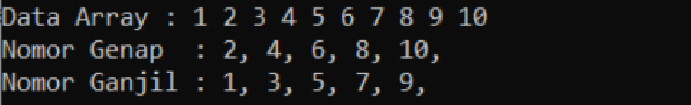
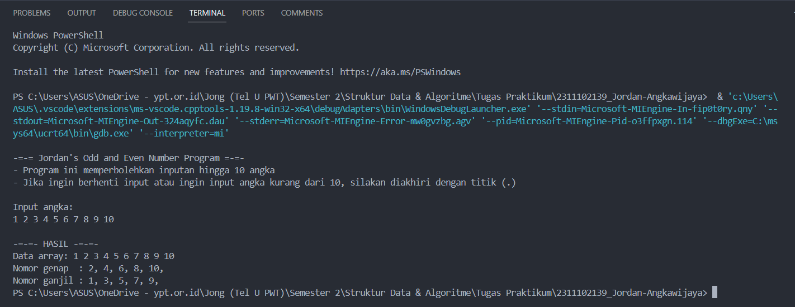
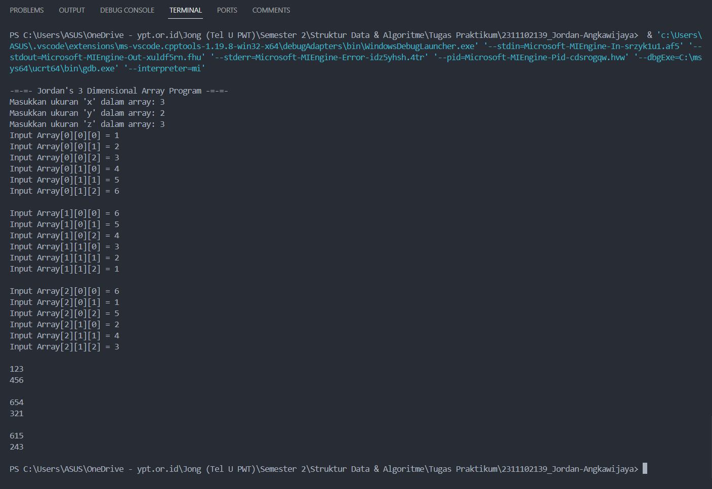
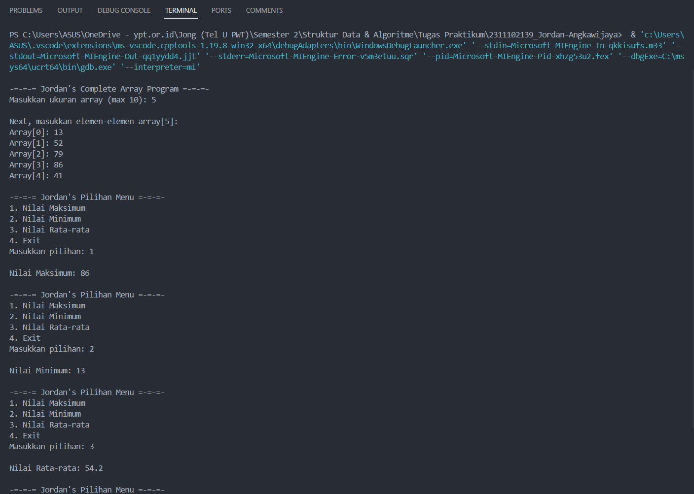

# <h1 align="center">Laporan Praktikum Modul 2 - Array</h1>
<p align="center">Jordan Angkawijaya - 2311102139</p>

## Dasar Teori
Array adalah kumpulan-kumpulan variabel yang menyimpan data dengan tipe yang sama atau data-data yang tersusun secara linear dimana di dalamnya terdapat elemen dengan tipe yang sama. Indeks dalam array menyatakan elemen yang disimpan dan panjang atau length menyatakan total elemen yang tersimpan. Jenis-jenis tipe data array yang umum diketahui ada 3, yaitu:
1. Array Satu Dimensi<br/>
    Array satu dimensi adalah jenis array dasar yang terdiri dari beberapa kolom elemen. Dalam satu baris tersusun dari beberapa elemen-elemen yang sama. Keunggulan dari array satu dimensi adalah mudah digunakan dan mudah dibaca sehingga paling umum digunakan.
    Contohnya:
    - Nilai[5] untuk menyimpan 5 nilai integer
    - Nama[10] untuk menyimpan 10 nama string
2. Array Dua Dimensi<br/>
    Array dua dimensi merupakan perluasan dari array satu dimensi sehingga array dua dimensi terdiri dari kolom dan baris atau berbentuk matrix. Maka harus perhatikan nomor baris dan kolom. Umumnya, jenis data dua dimensi ini memiliki fungsi untuk menampilkan sebuah data yang memiliki dua jenis elemen secara berbeda.
    Contohnya:
    - NilaiUjian[3][5] untuk menyimpan nilai ujian 3 siswa untuk 5 mata pelajaran
    - Peta[10][10] untuk menyimpan data peta dengan 10 baris dan 10 kolom
3. Array Multidimensi<br/>
    Array multidimensi digunakan untuk ke array yang lebih dari dua dimensi atau lebih. Bentuknya memiliki banyak dimensi sehingga untuk menentukan posisi elemen data tidak menggunakan indeks namun menggunakan key atau string. String merupakan array dari karakter. Array ini dapat digunakan untuk menyimpan data yang lebih kompleks, seperti data spasial atau data temporal.
    Contohnya:
    - Warna[3][3][3] untuk menyimpan data warna RGB untuk 3 objek dengan 3 bagian dan 3 warna
    - DataSensor[100][365][24] untuk menyimpan data sensor setiap jam selama 1 tahun untuk 100 sensor

## Guided 

### 1. Program Input Array Tiga Dimensi

```C++
#include <iostream>
using namespace std;

// Program input array 3 dimensi
int main()
{
    // Deklarasi array
    int arr[2][3][3];

    // Input elemen
    for (int x = 0; x < 2; x++)
    {
        for (int y = 0; y < 3; y++)
        {
            for (int z = 0; z < 3; z++)
            {
                cout << "Input Array[" << x << "][" << y << "][" << z << "] = ";
                cin >> arr[x][y][z];
            }
        }
        cout << endl;
    }

    // Output Array
    for (int x = 0; x < 2; x++)
    {
        for (int y = 0; y < 3; y++)
        {
            for (int z = 0; z < 3; z++)
            {
                cout << "Data Array[" << x << "][" << y << "][" << z << "] = " << arr[x][y][z] << endl;
            }
        }
    }
    cout << endl;

    // Tampilan array
    for (int x = 0; x < 2; x++)
    {
        for (int y = 0; y < 3; y++)
        {
            for (int z = 0; z < 3; z++)
            {
                cout << arr[x][y][z] << ends;
            }
            cout << endl;
        }
        cout << endl;
    }
}
```
Kode di atas digunakan untuk menginput nilai pada array tiga dimensi. Pada kode di atas, dideklarasikan size array tiga dimensi itu, yaitu x bernilai 2, y bernilai 3, dan z bernilai 3 juga. Proses penginputan elemen ke dalam array tiga dimensi itu dibantu dengan nested loop x, y, dan z hingga mencapai size masing-masing. Jika user sudah menginput semua nilai ke dalam array tiga dimensi, maka akan muncul 2 macam output, yaitu output array dan output nilai-nilai murni yang diinput user tanpa tanda kurung siku [].

### 2. Program Mencari Nilai Maksimal pada Array

```C++
#include <iostream>
using namespace std;

// Program Mencari Nilai Maksimal pada Array

int main()
{
    int maks, a, i = 1, lokasi;
    cout << "Masukkan panjang array: ";
    cin >> a;
    int array[a];
    cout << "Masukkan " << a << " angka\n";
    for (i = 0; i < a; i++)
    {
        cout << "Array ke-" << (i) << ": ";
        cin >> array[i];
    }
    maks = array[0];
    for (i = 0; i < a; i++)
    {
        if (array[i] > maks)
        {
            maks = array[i];
            lokasi = i;
        }
    }
    cout << "Nilai maksimum adalah " << maks << " berada di Array ke " << lokasi << endl;
}
```
Kode di atas digunakan untuk mencari nilai tertinggi atau maksimal pada suatu array. Pada kode di atas, terdapat array berdimensi satu di mana size nya sesuai dengan jumlah nilai yang diinput user. Jika user menginput nilai 5 pada saat penginputan panjang array, maka panjang array tersebut adalah 5. Setelah memasukkan panjang array, kode meminta user untuk menginput nilai-nilai pada array tersebut. Jika panjang arraynya 5, maka user harus menginput nilai apapun sebanyak 5 kali. Jika sudah, kode akan mengecek nilai tertinggi pada array tersebut dengan bantuan perulangan for dan if. Jika kode menemukan nilai maksimalnya, maka nilai array[i] akan menjadi maks, dan i akan menjadi lokasi. Lalu, variabel lokasi akan ditampilkan sebagai nilai tertinggi pada array tersebut.

## Unguided 

### 1. Buatlah program untuk menampilkan output seperti berikut dengan data yang diinputkan oleh user!


```C++
/*
oleh Jordan Angkawijaya - 2311102139
*/

#include <iostream>

using namespace std;

int main() {
    const int SizeLimit_2139 = 10; // Maksimal 10 angka, dengan const agar tidak terubah
    int Data_2139[SizeLimit_2139]; // Array untuk menyimpan angka
    int DataAmount_2139 = 0; // Jumlah angka yang sudah dimasukkan, 0 karena belum ada angka yang dimasukkan

    cout << "\n-=-= Jordan's Odd and Even Number Program =-=-" << endl;
    cout << "- Program ini memperbolehkan inputan hingga 10 angka" << endl;
    cout << "- Jika ingin berhenti input atau ingin input angka kurang dari 10, silakan diakhiri dengan titik (.)" << endl;
    cout << "\nInput angka: " << endl;
    
    // DataAmount_2139 akan terus bertambah sampai DataAmount_2139 mencapai SizeLimit_2139 atau input tidak valid
    while (DataAmount_2139 < SizeLimit_2139 && cin >> Data_2139[DataAmount_2139]) { 
        DataAmount_2139++;
    }

    cout << "\n-=-=- HASIL -=-=-" << endl;

    // Menampilkan data array yang sudah diinput oleh user
    cout << "Data array: ";
    for (int i = 0; i < DataAmount_2139; ++i) // Melakukan perulangan untuk menampilkan data array
        cout << Data_2139[i] << " ";
    cout << endl;

    // Menampilkan angka genap, jika angkanya habis dibagi 2 maka akan ditampilkan
    cout << "Nomor genap  : ";
    for (int i = 0; i < DataAmount_2139; ++i) { // Melakukan perulangan untuk mengecek angka genap
        if (Data_2139[i] % 2 == 0)
            cout << Data_2139[i] << ", ";
    }
    cout << endl;

    // Menampilkan angka ganjil, jika angkanya tidak habis dibagi 2 maka akan ditampilkan
    cout << "Nomor ganjil : ";
    for (int i = 0; i < DataAmount_2139; ++i) { // Melakukan perulangan untuk mengecek angka ganjil
        if (Data_2139[i] % 2 != 0)
            cout << Data_2139[i] << ", ";
    }
    cout << endl;

    return 0;
}
```
#### Output:
   
Kode di atas digunakan untuk menentukan bilangan ganjil dan genap dari inputan user. Pada kode di atas, terdapat tiga variabel, yaitu:
- const int SizeLimit_2139 untuk menentukan maksimal angka yang dapat diinput user, dilengkapi dengan const supaya tidak bisa diubah
- int Data_2139[SizeLimit_2139] untuk wadah array menyimpan angka yang diinput user
- int DataAmount_2139 untuk wadah jumlah angka yang sudah dimasukkan user, defaultnya 0 karena sudah pasti di awal tidak ada angka yang diinput
Jadi user bisa menginput hingga 10 angka sebelum programnya menampilkan hasil output data array beserta bilangan genap dan ganjilnya. Jika user ingin menginput jumlah angka dibawah 10, user dapat mengakhiri dengan karakter selain angka, seperti tanda titik (.). Jika user sudah menginput, program dapat menampilkan output data array dengan perulangan for, output bilangan genap dengan perulangan for dan percabangan if jika bilangan tersebut habis dibagi 2, dan bilangan ganjil dengan perulangan for dan percabangan if jika bilangan tersebut tidak habis dibagi 2.

### 2. Buatlah program input array tiga dimensi (seperti pada guided) tetapi jumlah atau ukuran elemennya diinputkan oleh user!

```C++
/*
oleh Jordan Angkawijaya - 2311102139
*/

#include <iostream>
using namespace std;

int main()
{
    // Deklarasi isi array
    int SizeX_2139, SizeY_2139, SizeZ_2139;

    // Meminta input ukuran array dari user
    cout << "\n-=-=- Jordan's 3 Dimensional Array Program -=-=-" << endl;
    cout << "Masukkan ukuran 'x' dalam array: "; cin >> SizeX_2139;
    cout << "Masukkan ukuran 'y' dalam array: "; cin >> SizeY_2139;
    cout << "Masukkan ukuran 'z' dalam array: "; cin >> SizeZ_2139;

    // Deklarasi array tiga dimensi berdasarkan input user
    int arr[SizeX_2139][SizeY_2139][SizeZ_2139];

    // Input elemen array
    for (int x = 0; x < SizeX_2139; x++) // Looping untuk menginput nilai x dalam array
    {
        for (int y = 0; y < SizeY_2139; y++) // Looping untuk menginput nilai y dalam array
        {
            for (int z = 0; z < SizeZ_2139; z++) // Looping untuk menginput nilai z dalam array
            {
                cout << "Input Array[" << x << "][" << y << "][" << z << "] = ";
                cin >> arr[x][y][z];
            }
        }
        cout << endl;
    }

    // Tampilan array
    for (int x = 0; x < SizeX_2139; x++) // Looping untuk menampilkan nilai x dalam array
    {
        for (int y = 0; y < SizeY_2139; y++) // Looping untuk menampilkan nilai y dalam array
        {
            for (int z = 0; z < SizeZ_2139; z++) // Looping untuk menampilkan nilai z dalam array
            {
                cout << arr[x][y][z] << ends;
            }
            cout << endl;
        }
        cout << endl;
    }

    return 0;
}
```
#### Output:
    
Kode di atas digunakan untuk menampilkan array tiga dimensi, di mana jumlah atau ukuran elemen arraynya diinputkan oleh user. Kode di atas sangat mirip dengan Guided 1, hanya perbedaannya ada di:
- Jumlah atau ukuran elemen array tiga dimensi ini ditentukan manual oleh inputan user
- Dibandingkan Guided 1, outputnya hanya 1 jenis, yaitu bilangan murni yang diinput user tanpa adanya bilangan siku []
Cara kerjanya juga mirip dengan Guided 1, di mana proses penginputan elemen ke dalam array tiga dimensi itu dibantu dengan nested loop x, y, dan z hingga mencapai size yang sudah ditentukan oleh user sebelumnya.

### 3. Buatlah program menu untuk mencari nilai maksimum, minimum dan nilai rata – rata dari suatu array dengan input yang dimasukkan oleh user!

```C++
/*
oleh Jordan Angkawijaya - 2311102139
*/

#include <iostream>
using namespace std;

int main() {
    const int MaxSize_2139 = 10; // Maksimum ukuran array
    int arr[MaxSize_2139]; // Array untuk menyimpan elemen-elemen
    int Size_2139, Choice_2139; // Deklarasi variabel untuk menyimpan ukuran array dan pilihan menu

    cout << "\n-=-=-= Jordan's Complete Array Program =-=-=-" << endl;
    cout << "Masukkan ukuran array (max 10): "; // Meminta user untuk memasukkan ukuran array
    cin >> Size_2139;

    // Memastikan ukuran yang dimasukkan tidak melebihi batas maksimum
    if (Size_2139 > MaxSize_2139) {
        cout << "Uhh your array too long" << endl;
        return 1;
    }

    // Meminta user untuk memasukkan elemen-elemen array
    cout << "\nNext, masukkan elemen-elemen array[" << Size_2139 << "]: " << endl;
    for (int i = 0; i < Size_2139; ++i) {
        cout << "Array[" << i << "]: ";
        cin >> arr[i];
    }

    // Menampilkan menu
    do {
    cout << "\n-=-=-= Jordan's Pilihan Menu =-=-=-" << endl;
    cout << "1. Nilai Maksimum" << endl;
    cout << "2. Nilai Minimum" << endl;
    cout << "3. Nilai Rata-rata" << endl;
    cout << "4. Exit" << endl;
    cout << "Masukkan pilihan: ";
    cin >> Choice_2139;

    // Melakukan operasi sesuai pilihan menu
    switch (Choice_2139) {
        case 1: { // Mencari nilai maksimum
            int max = -2147483648; // Nilai minimum untuk integer, supaya nilai maksimum yang dicari pasti lebih besar
            for (int i = 0; i < Size_2139; ++i) { // Mencari nilai maksimum
                if (arr[i] > max) { // Jika nilai array lebih besar dari nilai maksimum
                    max = arr[i]; // Maka nilai maksimum diubah menjadi nilai array
                }
            }
            cout << "\nNilai Maksimum: " << max << endl;
            break;
        }

        case 2: { // Mencari nilai minimum
            int min = 2147483647; // Nilai maksimum untuk integer, supaya nilai minimum yang dicari pasti lebih kecil
            for (int i = 0; i < Size_2139; ++i) { // Mencari nilai minimum
                if (arr[i] < min) { // Jika nilai array lebih kecil dari nilai minimum
                    min = arr[i]; // Maka nilai minimum diubah menjadi nilai array
                }
            }
            cout << "\nNilai Minimum: " << min << endl;
            break;
        }

        case 3: { // Mencari nilai rata-rata
            double sum = 0; // Inisialisasi variabel untuk menyimpan jumlah elemen array
            for (int i = 0; i < Size_2139; ++i) { // Menjumlahkan semua elemen array
                sum += arr[i]; // Menjumlahkan semua elemen array
            }
            double average = sum / Size_2139; // Mencari rata-rata
            cout << "\nNilai Rata-rata: " << average << endl;
            break;
        }

        case 4: // Keluar dari program
            cout << "\nThanks for using Jordan's program!" << endl;
            return 0;

        default:
            cout << "\nWrong choice, try again" << endl;
        }

    } while (Choice_2139 != 0); // Looping menu pilihan

    return 0;
}
```
#### Output:
 
Kode di atas digunakan untuk mencari nilai maksimum/tertinggi, minimum/terendah, dan rata-rata dari suatu array dengan input yang dimasukkan oleh user. Pada kode di atas, terdapat 4 variabel, yaitu:
- const int MaxSize_2139, berfungsi sebagai maksimal ukuran array. Pada kode di atas, maksimal ukuran arraynya adalah 10
- int arr[MaxSize_2139], array untuk menyimpan elemen-elemen integer
- int Size_2139, variabel untuk menentukan size array yang diinput oleh user, di mana Size_2139 harus lebih kecil dari MaxSize_2139. Jika lebih besar, maka akan muncul error.
- int Choice_2139, variabel untuk memilih pilihan dari menu maksimal, minimal, dan rata-rata
Pada saat program mulai, user akan diminta untuk menentukan ukuran array di mana maksimalnya adalah 10. Setelah menentukan ukuran array, user diminta untuk mengisi array dengan sejumlah bilangan sesuai ukuran arraynya. Setelah diisi, user diberikan menu supaya user dapat memilih untuk menampilkan output nilai maksimum, minimum, rata-rata dari array tersebut, atau keluar dari program. 
Logika maksimum diawali dengan menentukan int max yang diisi dengan nilai terkecil pada tipe data integer, yaitu -2147483648. Lalu menjalani logika perulangan for dan percabangan if untuk mencari nilai tertinggi dalam array tersebut. Logika minimum juga sama, tetapi diawali dengan menentukan int min yang diisi dengan nilai terbesar pada tipe data integer, yaitu 2147483647. Untuk logika rata-rata, digunakan tipe data double supaya bisa menampilkan bilangan desimal. Dengan logika dijumlahkan terlebih dahulu lalu dibagikan dengan variabel Size_2139, nilai rata-rata dapat ditemukan. Dilengkapi juga dengan perulangan do while untuk mengulangi pilihan menunya.

## Kesimpulan
Pada intinya, array adalah struktur data yang digunakan untuk menyimpan sekumpulan data dalam satu tempat, di mana setiap data dalam array memiliki indeks, sehingga mudah untuk diproses. Array memudahkan user dalam menyimpan dan mengorganisir data, serta memudahkan akses data dengan menggunakan indeks. Umumnya, array dibagi menjadi 3 jenis, yaitu:
- Array Satu Dimensi, hanya memiliki satu baris, dengan format Data[]
- Array Dua Dimensi, memiliki dua baris, dengan format Data[][]
- Array Multidimensi, memiliki lebih dari dua dimensi, dengan format Data[][][]

## Referensi
[1] Khoirudin, Algoritma & Struktur Data dengan Python 3. Semarang: Universitas Semarang Press, 2019.<br/>
[2] Meidyan Permata Putri, et al., Algoritma dan Struktur Data. Bandung: Widina Bhakti Persada Bandung, 2022.<br/>
[3] Muhammad Nugraha, Dasar Pemrograman Dengan C++, Materi Paling Dasar untuk Menjadi Programmer Berbagai Platform. Yogyakarta: Deepublish, 2021.