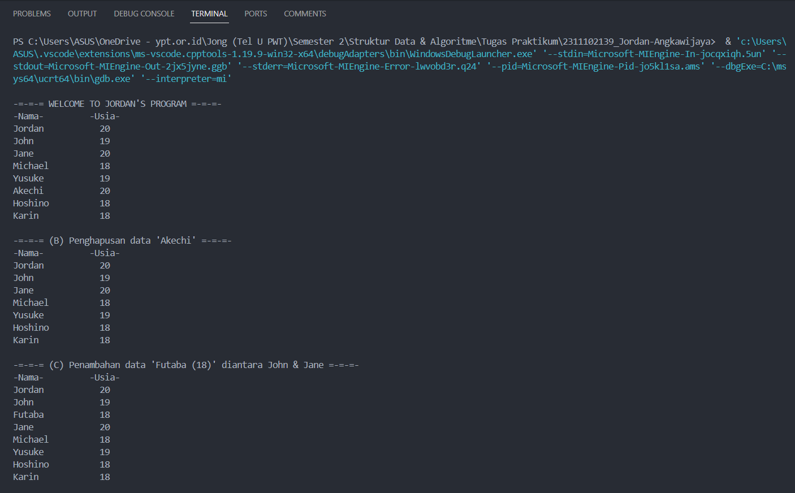
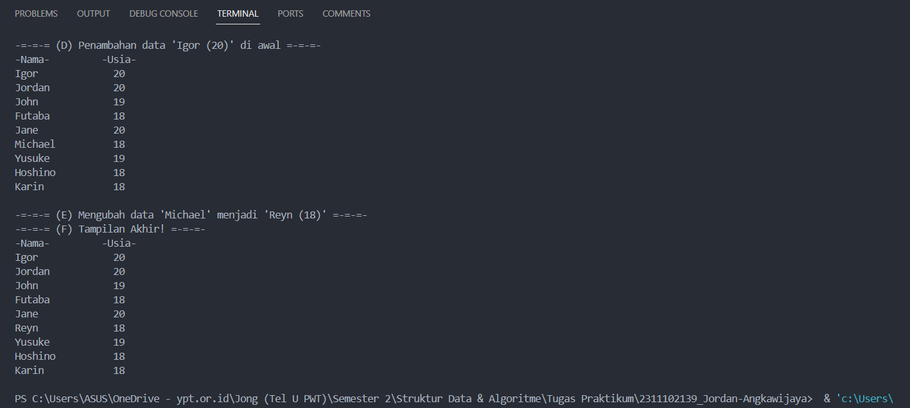
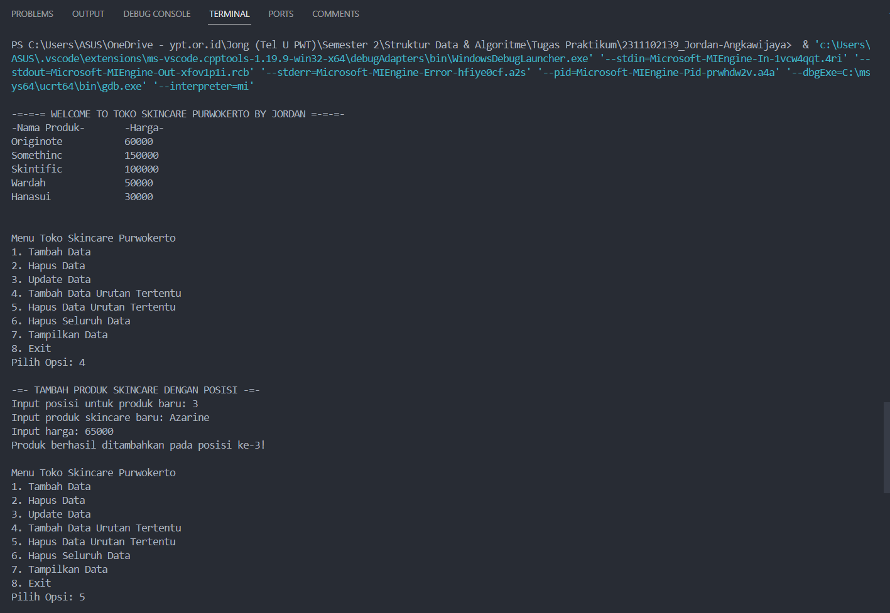
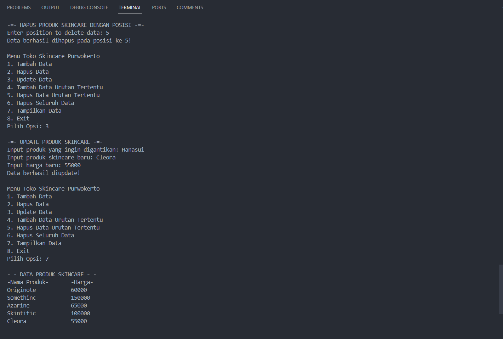

# <h1 align="center">Laporan Praktikum Modul 3 - Linked List</h1>
<p align="center">Jordan Angkawijaya - 2311102139</p>

## Dasar Teori
Linked list adalah strukur data linier berbentuk rantai simpul di mana setiap simpul menyimpan 2 item, yaitu nilai data dan pointer ke simpul elemen berikutnya. Berbeda dengan array, elemen linked list tidak ditempatkan dalam alamat memori yang berdekatan melainkan elemen ditautkan menggunakan pointer. Simpul pertama dari linked list disebut sebagai head atau simpul kepala. Apabila linked list berisi elemen kosong, maka nilai pointer dari head menunjuk ke NULL. Begitu juga untuk pointer berikutnya dari simpul terakhir atau simpul ekor akan menunjuk ke NULL.</br> 
Pada praktikum modul ini, ada dua jenis linked list yang dibahas secara rinci, yaitu Single Linked List dan Double Linked List.

- Single Linked List</br>
Single linked list adalah struktur data linear dimana setiap node memiliki dua bagian, yaitu Data (informasi aktual yang disimpan di dalam node) dan Next Link (Pointer yang menunjuk ke node berikutnya di dalam urutan). Single Linked List ini dibagi menjadi dua macam, yaitu:
    - Single Linked List non Circular</br>
    Sebuah Single Linked List non-circular adalah struktur data linear yang tersusun dari node-node yang terhubung satu sama lain. Namun, pada Single Linked List non-circular, pointer next pada node terakhir akan menunjuk ke NULL. Ini menandakan akhir dari list.</br>
    - Single Linked List Cirucular</br>
    Sebuah Single Linked List circular mirip dengan Single Linked List non-circular, namun dengan perbedaan pada pointer next pada node terakhir. Dalam Single Linked List circular, pointer next pada node terakhir akan menunjuk kembali ke node pertama (head) sehingga membentuk lingkaran tertutup.</br>
Perbedaan circular linked list dan non circular linked adalah penunjuk next pada node terakhir pada circular linked list akan selalu merujuk ke node pertama.

- Double Linked List</br>
Double Linked List adalah elemen-elemen yang dihubungkan dengan dua pointer dalam satu elemen dan list dapat melintas baik di depan atau belakang. Double Linked List memungkinkan untuk melakukan operasi penghapusan dan penambahan pada simpul mana saja secara efisien. Setiap simpul pada Double Linked List memiliki tiga elemen penting, yaitu:
    1. Bagian data informasi</br>
    2. Pointer next yang menunjuk ke elemen berikutnya</br>
    3. Pointer prev yang menunjuk ke elemen sebelumnya</br>
Keuntungan dari Double Linked List adalah memungkinkan untuk melakukan operasi penghapusan dan penambahan pada simpul dimana saja dengan efisien, sehingga sangat berguna dalam implementasi beberapa algoritma yang membutuhkan operasi tersebut. Double Linked List juga dapat melakukan traversal pada list baik dari depan (head) maupun dari belakang (tail) dengan mudah.

## Guided 

### 1. Latihan Single Linked List

```C++
// Latihan Single Linked List

#include <iostream>
using namespace std;

///PROGRAM SINGLE LINKED LIST NON-CIRCULAR
//Deklarasi Struct Node
struct Node {
    int data;
    Node* next;
};

Node* head;
Node* tail;

//Inisialisasi Node
void init() {
    head = NULL;
    tail = NULL;
}

// Pengecekan
bool isEmpty() {
    if (head == NULL)
        return true;
    else
        return false;
}

//Tambah Depan
void insertDepan(int nilai) {
    //Buat Node baru
    Node* baru = new Node;
    baru->data = nilai;
    baru->next = NULL;

    if (isEmpty() == true) {
        head = tail = baru;
        tail->next = NULL;
    }
    else {
        baru->next = head;
        head = baru;
    }
}

//Tambah Belakang
void insertBelakang(int nilai) {
    //Buat Node baru
    Node* baru = new Node;
    baru->data = nilai;
    baru->next = NULL;

    if (isEmpty() == true) {
        head = tail = baru;
        tail->next = NULL;
    }
    else {
        tail->next = baru;
        tail = baru;
    }
}

//Hitung Jumlah List
int hitungList() {
    Node* hitung;
    hitung = head;
    int jumlah = 0;

    while (hitung != NULL) {
        jumlah++;
        hitung = hitung->next;
    }

    return jumlah;
}

//Tambah Tengah
void insertTengah(int data, int posisi) {
    if (posisi < 1 || posisi > hitungList()) {
        cout << "Posisi diluar jangkauan" << endl;
    }
    else if (posisi == 1) {
        cout << "Posisi bukan posisi tengah" << endl;
    }
    else {
        Node* baru, * bantu;
        baru = new Node();
        baru->data = data;

        // tranversing
        bantu = head;
        int nomor = 1;

        while (nomor < posisi - 1) {
            bantu = bantu->next;
            nomor++;
        }

        baru->next = bantu->next;
        bantu->next = baru;
    }
}

//Hapus Depan
void hapusDepan() {
    Node* hapus;

    if (isEmpty() == false) {
        if (head->next != NULL) {
            hapus = head;
            head = head->next;
            delete hapus;
        }
        else {
            head = tail = NULL;
        }
    }
    else {
        cout << "List kosong!" << endl;
    }
}

//Hapus Belakang
void hapusBelakang() {
    Node* hapus;
    Node* bantu;

    if (isEmpty() == false) {
        if (head != tail) {
            hapus = tail;
            bantu = head;

            while (bantu->next != tail) {
                bantu = bantu->next;
            }

            tail = bantu;
            tail->next = NULL;
            delete hapus;
        }
        else {
            head = tail = NULL;
        }
    }
    else {
        cout << "List kosong!" << endl;
    }
}

//Hapus Tengah
void hapusTengah(int posisi) {
    Node* hapus, * bantu, * bantu2;

    if (posisi < 1 || posisi > hitungList()) {
        cout << "Posisi di luar jangkauan" << endl;
    }
    else if (posisi == 1) {
        cout << "Posisi bukan posisi tengah" << endl;
    }
    else {
        int nomor = 1;
        bantu = head;

        while (nomor <= posisi) {
            if (nomor == posisi - 1) {
                bantu2 = bantu;
            }

            if (nomor == posisi) {
                hapus = bantu;
            }

            bantu = bantu->next;
            nomor++;
        }

        bantu2->next = bantu;
        delete hapus;
    }
}

//Ubah Depan
void ubahDepan(int data) {
    if (isEmpty() == false) {
        head->data = data;
    }
    else {
        cout << "List masih kosong!" << endl;
    }
}

//Ubah Tengah
void ubahTengah(int data, int posisi) {
    Node* bantu;

    if (isEmpty() == false) {
        if (posisi < 1 || posisi > hitungList()) {
            cout << "Posisi di luar jangkauan" << endl;
        }
        else if (posisi == 1) {
            cout << "Posisi bukan posisi tengah" << endl;
        }
        else {
            bantu = head;
            int nomor = 1;

            while (nomor < posisi) {
                bantu = bantu->next;
                nomor++;
            }

            bantu->data = data;
        }
    }
    else {
        cout << "List masih kosong!" << endl;
    }
}

//Ubah Belakang
void ubahBelakang(int data) {
    if (isEmpty() == false) {
        tail->data = data;
    }
    else {
        cout << "List masih kosong!" << endl;
    }
}

//Hapus List
void clearList() {
    Node* bantu, * hapus;
    bantu = head;

    while (bantu != NULL) {
        hapus = bantu;
        bantu = bantu->next;
        delete hapus;
    }

    head = tail = NULL;
    cout << "List berhasil terhapus!" << endl;
}

//Tampilkan List
void tampil() {
    Node* bantu;
    bantu = head;

    if (isEmpty() == false) {
        while (bantu != NULL) {
            cout << bantu->data << ends;
            bantu = bantu->next;
        }

        cout << endl;
    }
    else {
        cout << "List masih kosong!" << endl;
    }
}

int main() {
    init();
    insertDepan(3);
    tampil();
    insertBelakang(5);
    tampil();
    insertDepan(2);
    tampil();
    insertDepan(1);
    tampil();
    hapusDepan();
    tampil();
    hapusBelakang();
    tampil();
    insertTengah(7, 2);
    tampil();
    hapusTengah(2);
    tampil();
    ubahDepan(1);
    tampil();
    ubahBelakang(8);
    tampil();
    ubahTengah(11, 2);
    tampil();

    return 0;
}
```
Kode di atas digunakan untuk menjalankan single linked list. Struct node ini dideklarasikan dengan int data dan Node* next. Inisialisasi node nya juga dengan prosedur void init(), head dan tailnya dideklarasikan NULL. Ada juga fungsi bool isEmpty() untuk mengecek apakah kosong atau tidak. Berikut ini adalah fungsi-fungsi yang akan dipanggil dalam int main():
- void insertDepan(int nilai)</br>
    Digunakan untuk menambahkan data di depan
- void insertBelakang(int nilai)</br>
    Digunakan untuk menambahkan data di belakang
- int hitungList()</br>
    Digunakan untuk menghitung jumlah data yang ada
- void insertTengah(int data, int posisi)</br>
    Digunakan untuk menambahkan data sesuai posisi yang diinginkan user
- void hapusDepan()</br>
    Digunakan untuk menghapus data di depan
- void hapusBelakang()</br>
    Digunakan untuk menghapus data di belakang
- void hapusTengah(int posisi)</br>
    Digunakan untuk menghapus data sesuai posisi yang diinginkan user
- void ubahDepan(int data)</br>
    Digunakan untuk mengubah data di depan
- void ubahTengah(int data, int posisi)</br>
    Digunakan untuk mengubah data sesuai posisi yang diinginkan user
- void ubahBelakang(int data)</br>
    Digunakan untuk mengubah data di belakang
- void clearList()</br>
    Digunakan untuk menghapus seluruh data
- void tampil()</br>
    Digunakan untuk menampilkan data</br>
<p>Lalu, di dalam int main() dideklarasikan fungsi-fungsi tersebut. Hasil akhir pada pendeklarasian tersebut adalah 111.</p>

### 2. Latihan Double Linked List

```C++
// Latihan Double Linked List
#include <iostream>
using namespace std;

class Node {
public:
    int data;
    Node* prev;
    Node* next;
};

class DoublyLinkedList {
public:
    Node* head;
    Node* tail;

    DoublyLinkedList() {
        head = nullptr;
        tail = nullptr;
    }

    void push(int data) {
        Node* newNode = new Node;
        newNode->data = data;
        newNode->prev = nullptr;
        newNode->next = head;

        if (head != nullptr) {
            head->prev = newNode;
        }
        else {
            tail = newNode;
        }

        head = newNode;
    }

    void pop() {
        if (head == nullptr) {
            return;
        }

        Node* temp = head;
        head = head->next;

        if (head != nullptr) {
            head->prev = nullptr;
        }
        else {
            tail = nullptr;
        }

        delete temp;
    }

    bool update(int oldData, int newData) {
        Node* current = head;

        while (current != nullptr) {
            if (current->data == oldData) {
                current->data = newData;
                return true;
            }
            current = current->next;
        }

        return false;
    }

    void deleteAll() {
        Node* current = head;

        while (current != nullptr) {
            Node* temp = current;
            current = current->next;
            delete temp;
        }

        head = nullptr;
        tail = nullptr;
    }

    void display() {
        Node* current = head;

        while (current != nullptr) {
            cout << current->data << " ";
            current = current->next;
        }

        cout << endl;
    }
};

int main() {
    DoublyLinkedList list;

    while (true) {
        cout << "1. Add data" << endl;
        cout << "2. Delete data" << endl;
        cout << "3. Update data" << endl;
        cout << "4. Clear data" << endl;
        cout << "5. Display data" << endl;
        cout << "6. Exit" << endl;

        int choice;
        cout << "Enter your choice: ";
        cin >> choice;

        switch (choice) {
            case 1: {
                int data;
                cout << "Enter data to add: ";
                cin >> data;
                list.push(data);
                break;
            }
            case 2: {
                list.pop();
                break;
            }
            case 3: {
                int oldData, newData;
                cout << "Enter old data: ";
                cin >> oldData;
                cout << "Enter new data: ";
                cin >> newData;

                bool updated = list.update(oldData, newData);

                if (!updated) {
                    cout << "Data not found" << endl;
                }
                break;
            }
            case 4: {
                list.deleteAll();
                break;
            }
            case 5: {
                list.display();
                break;
            }
            case 6: {
                return 0;
            }
            default: {
                cout << "Invalid choice" << endl;
                break;
            }
        }
    }

    return 0;
}
```
Kode di atas digunakan untuk menjalankan double linked list. Dalam class public Node, terdapat int data, Node* prev, dan Node* next. Lalu dalam class public DoublyLinkedList terdapat Node* head dan Node* tail, di mana terdapat juga fungsi DoublyLinkedList() untuk mendeklarasikan head & node sebagai nullptr. Dalam program ini, terdapat fungsi-fungsi yang akan dideklrasikan pada int main(), yaitu:
- void push(int data)</br>
    Digunakan untuk menambahkan data di depan
- void pop()</br>
    Digunakan untuk menghapuskan data di depan
- bool update(int oldData, int newData)</br>
    Digunakan untuk mengubah data sesuai data lama yang diinput user
- void deleteAll()</br>
    Digunakan untuk menghapus seluruh data
- void display()</br>
    Digunakan untuk menampilkan data</br>
<p>Lalu, dalam int main(), dideklarasikan fungsi DoublyLinkedList list dan menu untuk user memilih fungsi mana yang ingin dijalankan. Opsi 1 akan menjalankan fungsi push(), opsi 2 menjalankan fungsi pop(), opsi 3 menjalankan fungsi update(), opsi 4 menjalankan fungsi deleteAll(), opsi 5 menjalankan fungsi display(), dan opsi terakhir akan mengakhiri program. Program ini akan mengalami looping karena perulangan while selama input user bersifat true.</p>

## Unguided 

### 1. Buatlah program menu Single Linked List Non-Circular untuk menyimpan Nama dan Usia mahasiswa, dengan menggunakan inputan dari user. Lakukan operasi berikut:</br> ㅤa. Masukkan data sesuai urutan berikut. (Gunakan insert depan, belakang atau tengah). Data pertama yang dimasukkan adalah nama dan usia anda.</br> ㅤb. Hapus data Akechi</br> ㅤc. Tambahkan data berikut diantara John dan Jane: "Futaba 18"</br> ㅤd. Tambahkan data berikut di awal: "Igor 20"</br> ㅤe. Ubah data Michael menjadi: "Reyn 18"</br> ㅤf. Tampilkan seluruh data

```C++
/*
by Jordan Angkawijaya - 2311102139
*/

#include <iostream>
#include <iomanip>
using namespace std;

//Deklarasi Struct Node
struct Node {
    string Name_2139;
    int Age_2139;
    Node* next;
};

Node* head;
Node* tail;

//Inisialisasi Node
void Initialize_2139() {
    head = NULL;
    tail = NULL;
}

// Pengecekan
bool ItsEmpty_2139() {
    if (head == NULL)
        return true;
    else
        return false;
}

//Tambah Depan
void InsertFront_2139(string name, int age) {
    //Buat Node baru
    Node* baru = new Node;
    baru->Name_2139 = name;
    baru->Age_2139 = age;
    baru->next = NULL;

    if (ItsEmpty_2139() == true) {
        head = tail = baru;
        tail->next = NULL;
    }
    else {
        baru->next = head;
        head = baru;
    }
}

//Tambah Belakang
void InsertBack_2139(string name, int age) {
    //Buat Node baru
    Node* baru = new Node;
    baru->Name_2139 = name;
    baru->Age_2139 = age;
    baru->next = NULL;

    if (ItsEmpty_2139() == true) {
        head = tail = baru;
        tail->next = NULL;
    }
    else {
        tail->next = baru;
        tail = baru;
    }
}

//Hitung Jumlah List
int CountList_2139() {
    Node* hitung;
    hitung = head;
    int jumlah = 0;

    while (hitung != NULL) {
        jumlah++;
        hitung = hitung->next;
    }

    return jumlah;
}

//Tambah Tengah
void InsertMiddle_2139(string name, int age, int posisi) {
    if (posisi < 1 || posisi > CountList_2139()) {
        cout << "Heyyy, the position is out of range!" << endl;
    }
    else if (posisi == 1) {
        cout << "Wow, the position you input wasn't the middle." << endl;
    }
    else {
        Node* baru, * bantu;
        baru = new Node();
        baru->Name_2139 = name;
        baru->Age_2139 = age;

        // tranversing
        bantu = head;
        int nomor = 1;

        while (nomor < posisi - 1) {
            bantu = bantu->next;
            nomor++;
        }

        baru->next = bantu->next;
        bantu->next = baru;
    }
}

//Hapus Depan
void EraseFront_2139() {
    Node* hapus;

    if (ItsEmpty_2139() == false) {
        if (head->next != NULL) {
            hapus = head;
            head = head->next;
            delete hapus;
        }
        else {
            head = tail = NULL;
        }
    }
    else {
        cout << "ITS EMPTY!" << endl;
    }
}

//Hapus Belakang
void EraseBack_2139() {
    Node* hapus;
    Node* bantu;

    if (ItsEmpty_2139() == false) {
        if (head != tail) {
            hapus = tail;
            bantu = head;

            while (bantu->next != tail) {
                bantu = bantu->next;
            }

            tail = bantu;
            tail->next = NULL;
            delete hapus;
        }
        else {
            head = tail = NULL;
        }
    }
    else {
        cout << "ITS EMPTY!" << endl;
    }
}

//Hapus Tengah
void EraseMiddle_2139(int posisi) {
    Node* hapus, * bantu, * bantu2;

    if (posisi < 1 || posisi > CountList_2139()) {
        cout << "Heyyy, the position is out of range!" << endl;
    }
    else if (posisi == 1) {
        cout << "Wow, the position you input wasn't the middle." << endl;
    }
    else {
        int nomor = 1;
        bantu = head;

        while (nomor <= posisi) {
            if (nomor == posisi - 1) {
                bantu2 = bantu;
            }

            if (nomor == posisi) {
                hapus = bantu;
            }

            bantu = bantu->next;
            nomor++;
        }

        bantu2->next = bantu;
        delete hapus;
    }
}

//Ubah Depan
void ChangeFront_2139(string name, int age) {
    if (ItsEmpty_2139() == false) {
        head->Name_2139 = name;
        head->Age_2139 = age;
    }
    else {
        cout << "THERE'S NOTHING TO CHANGE!" << endl;
    }
}

//Ubah Tengah
void ChangeMiddle_2139(string name, int age, int posisi) {
    Node* bantu;

    if (ItsEmpty_2139() == false) {
        if (posisi < 1 || posisi > CountList_2139()) {
            cout << "Heyyy, the position is out of range!" << endl;
        }
        else if (posisi == 1) {
            cout << "Wow, the position you input wasn't the middle." << endl;
        }
        else {
            bantu = head;
            int nomor = 1;

            while (nomor < posisi) {
                bantu = bantu->next;
                nomor++;
            }

            bantu->Name_2139 = name;
            bantu->Age_2139 = age;
        }
    }
    else {
        cout << "ITS EMPTY!" << endl;
    }
}

//Ubah Belakang
void ChangeBack_2139(string name, int age) {
    if (ItsEmpty_2139() == false) {
        tail->Name_2139 = name;
        tail->Age_2139 = age;
    }
    else {
        cout << "ITS EMPTY" << endl;
    }
}

//Hapus List
void EraseList_2139() {
    Node* bantu, * hapus;
    bantu = head;

    while (bantu != NULL) {
        hapus = bantu;
        bantu = bantu->next;
        delete hapus;
    }

    head = tail = NULL;
    cout << "Hoorah! You erased EVERYTHING YOU WORKED HARD FOR!" << endl;
}

//Tampilkan List
void Reveal_2139() {
    Node* bantu;
    bantu = head;

    cout << left << setw(15) << "-Nama-" << right << setw(4) << "-Usia-" << endl; // Supaya rapi

    if (ItsEmpty_2139() == false) {
        while (bantu != NULL) {
            cout << left << setw(15) << bantu->Name_2139 << right << setw(4) << bantu->Age_2139 << endl; // Supaya lurus di output
            bantu = bantu->next;
        }

        cout << endl;
    }
    else {
        cout << "ITS EMPTY!" << endl;
    }
}

int main() {
    Initialize_2139(); // Inisialisasi Linked List
    cout << "\n-=-=-= WELCOME TO JORDAN'S PROGRAM =-=-=-" << endl; // Menampilkan nama dan umur awal & menjawab poin a
    InsertFront_2139("Karin", 18);
    InsertFront_2139("Hoshino", 18);
    InsertFront_2139("Akechi", 20); 
    InsertFront_2139("Yusuke", 19);
    InsertFront_2139("Michael", 18);
    InsertFront_2139("Jane", 20);
    InsertFront_2139("John", 19);
    InsertFront_2139("Jordan", 20);
    Reveal_2139();

    // Menjawab poin b
    cout << "-=-=-= (B) Penghapusan data 'Akechi' =-=-=-" << endl;
    EraseMiddle_2139(6);
    Reveal_2139();

    // Menjawab poin c
    cout << "-=-=-= (C) Penambahan data 'Futaba (18)' diantara John & Jane =-=-=-" << endl;
    InsertMiddle_2139("Futaba", 18, 3);
    Reveal_2139();

    // Menjawab poin d
    cout << "-=-=-= (D) Penambahan data 'Igor (20)' di awal =-=-=-" << endl;
    InsertFront_2139("Igor", 20);
    Reveal_2139();

    // Menjawab poin e & f
    cout << "-=-=-= (E) Mengubah data 'Michael' menjadi 'Reyn (18)' =-=-=-" << endl;
    cout << "-=-=-= (F) Tampilan Akhir! =-=-=-" << endl;
    ChangeMiddle_2139("Reyn", 18, 6);
    Reveal_2139();

    return 0;
}
```
#### Output:


Kode di atas digunakan untuk menjalankan single linked list. Struct node ini dideklarasikan dengan int Age_2139, string Name_2139, dan Node* next. Inisialisasi node nya juga dengan prosedur void Initialize_2139(), head dan tailnya dideklarasikan NULL. Ada juga fungsi bool ItsEmpty_2139() untuk mengecek apakah kosong atau tidak. Berikut ini adalah fungsi-fungsi yang akan dipanggil dalam int main():
- void InsertFront_2139(string name, int age)</br>
    Digunakan untuk menambahkan data di depan
- void InsertBack_2139(string name, int age)</br>
    Digunakan untuk menambahkan data di belakang
- int CountList_2139()</br>
    Digunakan untuk menghitung jumlah data yang ada
- void InsertMiddle_2139(string name, int age, int posisi)</br>
    Digunakan untuk menambahkan data sesuai posisi yang diinginkan user
- void EraseFront_2139()</br>
    Digunakan untuk menghapus data di depan
- void EraseBack_2139()</br>
    Digunakan untuk menghapus data di belakang
- void EraseMiddle_2139(int posisi)</br>
    Digunakan untuk menghapus data sesuai posisi yang diinginkan user
- void ChangeFront_2139(string name, int age)</br>
    Digunakan untuk mengubah data di depan
- void ChangeMiddle_2139(string name, int age, int posisi)</br>
    Digunakan untuk mengubah data sesuai posisi yang diinginkan user
- void ChangeBack_2139(string name, int age)</br>
    Digunakan untuk mengubah data di belakang
- void EraseList_2139()</br>
    Digunakan untuk menghapus seluruh data
- void Reveal_2139()</br>
    Digunakan untuk menampilkan data, dilengkapi dengan setw left & right dari library iomanip supaya outputnya rapi dan linear. </br>
<p>Lalu, pada int main(), diawali dengan inisialisasi linked list dengan Initialize_2139(). Pertama, ditampilkan seluruh data yang ada pada pertanyaan Unguided ini dengan InsertFront_2139(). Kedua, menghapus data 'Akechi' dengan fungsi EraseMiddle_2139(). Ketiga, menambahkan data 'Futaba (18)' dengan fungsi InsertMiddle_2139(). Keempat, menambahkan data 'Igor (20)' dengan fungsi InsertFront_2139(). Lalu akhirnya, mengubah data 'Michael' menjadi 'Reyn (18)' dengan fungsi ChangeMiddle_2139() dan ditampilkan dengan fungsi Reveal_2139().</p>

### 2. Modifikasi Guided Double Linked List dilakukan dengan penambahan operasi untuk menambah data, menghapus, dan update di tengah / di urutan tertentu yang diminta. Selain itu, buatlah agar tampilannya menampilkan Nama Produk dan Harga. </br>Case:</br> ㅤ1. Tambahkan produk Azarine dengan harga 65000 diantara Somethinc dan Skintific</br> ㅤ2. Hapus produk Wardah</br> ㅤ3. Update produk Hanasui menjadi Cleora dengan harga 55000</br> ㅤ4. Tampilkan menu, di mana tampilan akhirnya akan menjadi seperti dibawah ini:
  

```C++
/*
by Jordan Angkawijaaya - 2311102139
*/

#include <iostream>
#include <iomanip>
using namespace std;

// Deklarasi Struct Node
class Node {
public:
    string Product_2139;
    int Price_2139;
    Node* prev;
    Node* next;
};

// Deklarasi Class DoublyLinkedList
class DoublyLinkedList {
public:
    Node* head;
    Node* tail;

    // Constructor
    DoublyLinkedList() {
        head = nullptr;
        tail = nullptr;
    }

    // Prosedur untuk menambahkan data di depan
    void Push_2139(int Price_2139, string Product_2139) {
        Node* newNode = new Node;
        newNode->Price_2139 = Price_2139;
        newNode->Product_2139 = Product_2139;
        newNode->prev = nullptr;
        newNode->next = head;

        if (head != nullptr) {
            head->prev = newNode;
        }
        else {
            tail = newNode;
        }

        head = newNode;
    }

    // Prosedur untuk menambahkan data pada posisi tertentu
    void PushPosition_2139(int position, int Price_2139, string Product_2139) {
        if (position < 1) { // Jika posisi data kurang dari 1
            cout << "There's no position below 1.. you know that, right?" << endl;
            return;
        }

        Node* newNode = new Node;
        newNode->Price_2139 = Price_2139; // Mengisi data Price_2139
        newNode->Product_2139 = Product_2139; // Mengisi data Product_2139
        newNode->prev = nullptr; // Mengisi data prev
        newNode->next = nullptr; // Mengisi data next

        if (position == 1) {
            newNode->next = head;
            if (head != nullptr) // Jika head tidak kosong
                head->prev = newNode; // Menggeser head ke newNode
            else // Jika head kosong
                tail = newNode; // Menggeser tail ke newNode
            head = newNode;
            return;
        }

        Node* current = head; // Deklarasi variabel current
        for (int i = 1; i < position - 1 && current != nullptr; ++i) // Looping untuk mencari posisi data
            current = current->next; // Menggeser current ke next

        if (current == nullptr) { // Jika posisi data tidak ditemukan
            cout << "Whatever you input, it was wrong." << endl;
            delete newNode;
            return;
        }

        newNode->next = current->next;
        newNode->prev = current;
        if (current->next != nullptr) // Jika current->next tidak kosong
            current->next->prev = newNode;
        else // Jika current->next kosong
            tail = newNode;
        current->next = newNode;
    }

    // Prosedur untuk menghapus data di depan
    void Pop_2139() {
        if (head == nullptr) {
            return;
        }

        Node* temp = head;
        head = head->next;

        if (head != nullptr) {
            head->prev = nullptr;
        }
        else {
            tail = nullptr;
        }

        delete temp;
    }

    // Prosedur untuk menghapus data pada posisi tertentu
    void PopPosition_2139(int position) {
        if (head == nullptr) { // Jika list kosong
            cout << "WHAT ARE YOU TRYING TO DELETE?? THE LIST IS EMPTY!" << endl;
            return;
        }

        Node* temp = head; // Deklarasi variabel temp
        for (int i = 1; i < position && temp != nullptr; ++i) { // Looping untuk mencari posisi data
            temp = temp->next; // Menggeser temp ke next
        }

        if (temp == nullptr) { // Jika posisi data tidak ditemukan
            cout << "Whatever you just input, it's wrong." << endl;
            return;
        }

        if (temp->prev != nullptr) { // Jika temp->prev tidak kosong
            temp->prev->next = temp->next; // Menggeser temp->prev ke temp->next
        } else { // Jika temp->prev kosong
            head = temp->next; // Menggeser head ke temp->next
        }

        if (temp->next != nullptr) { // Jika temp->next tidak kosong
            temp->next->prev = temp->prev; // Menggeser temp->next ke temp->prev
        } else { // Jika temp->next kosong
            tail = temp->prev; // Menggeser tail ke temp->prev
        }

        delete temp; // Menghapus temp
    }

    // Fungsi untuk mengupdate data
    bool Update_2139(string oldProduct, string newProduct, int newPrice) {
        Node* current = head;

        while (current != nullptr) {
            if (current->Product_2139 == oldProduct) {
                current->Product_2139 = newProduct;
                current->Price_2139 = newPrice;
                return true;
            }
            current = current->next;
        }

        return false;
    }

    // Prosedur untuk menghapus semua data
    void DeleteAll_2139() {
        Node* current = head;

        while (current != nullptr) {
            Node* temp = current;
            current = current->next;
            delete temp;
        }

        head = nullptr;
        tail = nullptr;
    }

    // Prosedur untuk menampilkan data
    void Display_2139() {
        Node* current = head;

        cout << left << setw(20) << "-Nama Produk-" << right << setw(6) << "-Harga-" << endl; // Supaya rapi

        while (current != nullptr) {
            cout << left << setw(20) << current->Product_2139 << right << setw(4) << current->Price_2139 << endl;
            current = current->next;
        }

        cout << endl;
    }
};

int main() {
    DoublyLinkedList list; // Deklarasi objek list dari class DoublyLinkedList

    cout << "\n-=-=-= WELCOME TO TOKO SKINCARE PURWOKERTO BY JORDAN =-=-=-" << endl;

    // Deklarasi data awal dari Toko Skincare Purwokerto
    list.Push_2139(30000, "Hanasui");
    list.Push_2139(50000, "Wardah");
    list.Push_2139(100000, "Skintific");
    list.Push_2139(150000, "Somethinc");
    list.Push_2139(60000, "Originote");
    list.Display_2139(); // Menampilkan data awal

    while (true) { // Looping untuk menampilkan menu
        cout << "\nMenu Toko Skincare Purwokerto" << endl;
        cout << "1. Tambah Data" << endl;
        cout << "2. Hapus Data" << endl;
        cout << "3. Update Data" << endl;
        cout << "4. Tambah Data Urutan Tertentu" << endl;
        cout << "5. Hapus Data Urutan Tertentu" << endl;
        cout << "6. Hapus Seluruh Data" << endl;
        cout << "7. Tampilkan Data" << endl;
        cout << "8. Exit" << endl;

        int Choice_2139;
        cout << "Pilih Opsi: ";
        cin >> Choice_2139;

        switch (Choice_2139) {
            // Case untuk menambahkan data
            case 1: {
                int Price_2139;
                string Product_2139;

                cout << "\n-=- TAMBAH PRODUK SKINCARE -=-" << endl;
                cout << "Tambahkan produk skincare: ";
                cin.ignore(); // Mengabaikan karakter newline dari cin sebelumnya
                getline(cin, Product_2139); // Menggunakan getline agar bisa membaca spasi
                cout << "Harga produk: ";
                cin >> Price_2139;
                list.Push_2139(Price_2139, Product_2139); // Memanggil prosedur push untuk menambahkan data
                cout << "Produk berhasil ditambahkan!" << endl;
                break;
            }

            // Case untuk menghapus data
            case 2: {
                list.Pop_2139(); // Memanggil prosedur Pop_2139 untuk menghapus data
                cout << "Produk paling atas berhasil dimusnahkan!" << endl;
                break;
            }

            // Case untuk mengupdate data
            case 3: {
                string oldProduct, newProduct; // Declaring variables oldProduct and newProduct
                int newPrice; // Declaring variable newPrice

                cout << "\n-=- UPDATE PRODUK SKINCARE -=-" << endl;
                cout << "Input produk yang ingin digantikan: ";
                cin.ignore(); // Ignoring the newline character from the previous cin
                getline(cin, oldProduct); // Using getline to read the entire line
                cout << "Input produk skincare baru: ";
                getline(cin, newProduct);
                cout << "Input harga baru: ";
                cin >> newPrice;

                bool updated = list.Update_2139(oldProduct, newProduct, newPrice); // Calling the update function to update data
                if (updated) {
                    cout << "Data berhasil diupdate!" << endl;
                } else {
                    cout << "Uhh data tidak ditemukan!?" << endl;
                }
                break;
            }

            // Case untuk menambahkan data pada posisi tertentu
            case 4: {
                int position, Price_2139;
                string Product_2139;

                cout << "\n-=- TAMBAH PRODUK SKINCARE DENGAN POSISI -=-" << endl;
                cout << "Input posisi untuk produk baru: ";
                cin >> position; // Memasukkan posisi data yang ingin ditambahkan
                cout << "Input produk skincare baru: ";
                cin.ignore(); // Mengabaikan karakter newline dari cin sebelumnya
                getline(cin, Product_2139); // Menggunakan getline agar bisa membaca spasi
                cout << "Input harga: ";
                cin >> Price_2139;
                list.PushPosition_2139(position, Price_2139, Product_2139); // Memanggil prosedur PushPosition_2139 untuk menambahkan data pada posisi tertentu
                cout << "Produk berhasil ditambahkan pada posisi ke-" << position << "!" << endl;
                break;
            }

            // Case untuk menghapus data pada posisi tertentu
            case 5: {
                int position; // Deklarasi variabel position

                cout << "\n-=- HAPUS PRODUK SKINCARE DENGAN POSISI -=-" << endl;
                cout << "Enter position to delete data: ";
                cin >> position; // Memasukkan posisi data yang ingin dihapus
                list.PopPosition_2139(position); // Memanggil prosedur PopPosition_2139 untuk menghapus data pada posisi tertentu
                cout << "Data berhasil dihapus pada posisi ke-" << position << "!" << endl;
                break;
            }

            // Case untuk menghapus semua data
            case 6: {
                list.DeleteAll_2139(); // Memanggil prosedur DeleteAll_2139 untuk menghapus semua data
                cout << "Wah, semua data terhapus!" << endl;
                break;
            }

            // Case untuk menampilkan data
            case 7: {
                cout << "\n-=- DATA PRODUK SKINCARE -=-" << endl;
                list.Display_2139(); // Menampilkan data
                break;
            }

            // Case untuk keluar dari program
            case 8: {
                cout << "Exiting. . ." << endl;
                return 0;
            }
        }
    }

    return 0;
}
```
#### Output:
 
    
Kode di atas digunakan untuk menjalankan double linked list. Dalam class public Node, terdapat string Product_2139, int Price_2139, Node* prev, dan Node* next. Lalu dalam class public DoublyLinkedList terdapat Node* head dan Node* tail, di mana terdapat juga fungsi DoublyLinkedList() untuk mendeklarasikan head & node sebagai nullptr. Dalam program ini, terdapat fungsi-fungsi yang akan dideklrasikan pada int main(), yaitu:
- void Push_2139(int Price_2139, string Product_2139)</br>
    Digunakan untuk menambahkan data di depan
- void PushPosition_2139(int position, int Price_2139, string Product_2139)</br>
    Digunakan untuk menambahkan data sesuai dengan posisi yang diinginkan user
- void Pop_2139()</br>
    Digunakan untuk menghapuskan data di depan
- void PopPosition_2139(int position)</br>
    Digunakan untuk menghapuskan data sesuai dengan posisi yang diinginkan user
- bool Update_2139(string oldProduct, string newProduct, int newPrice)</br>
    Digunakan untuk mengubah data sesuai data lama yang diinput user
- void DeleteAll_2139()</br>
    Digunakan untuk menghapus seluruh data
- void Display_2139()</br>
    Digunakan untuk menampilkan data, dilengkapi dengan setw left & right dari library iomanip supaya outputnya rapi dan linear.</br>
<p>Lalu, dalam int main(), dideklarasikan fungsi DoublyLinkedList list dan menu untuk user memilih fungsi mana yang ingin dijalankan. Opsi 1 akan menjalankan fungsi Push_2139(), opsi 2 menjalankan fungsi Pop_2139(), opsi 3 menjalankan fungsi Update_2139(), opsi 4 menjalankan fungsi PushPosition_2139(), opsi 5 menjalankan fungsi PopPosition_2139(), opsi 6 menjalankan fungsi DeleteAll_2139(), opsi 7 menjalankan fungsi Display_2139(), dan opsi 8 akan mengakhiri program. Program ini akan mengalami looping karena perulangan while selama input user bersifat true.</p></br>

<p>Pertama, menambahkan produk Azarine (65000) dengan fungsi PushPosition_2139(). Kedua, menghapuskan produk Wardah dengan fungsi PopPosition_2139(). Ketiga, mengubah data produk Hanasui menjadi Cleora (55000) dengan fungsi Update_2139(). Lalu akhirnya, menampilkan hasil akhirnya dengan fungsi Display_2139().</p>

## Kesimpulan
Linked List adalah struktur data dinamis yang fleksibel. Berbeda dengan array, elemen-elemennya tidak perlu berada di memori yang berdekatan. Setiap elemen atau simpul pada Linked List menyimpan data dan penunjuk ke simpul berikutnya, membentuk rangkaian.</br>

Terdapat dua jenis Linked List yang dibahas pada modul ini, yaitu Single Linked List dan Double Linked List. Single Linked List hanya memiliki penunjuk ke elemen berikutnya, sedangkan Double Linked List memiliki penunjuk ke elemen berikutnya dan sebelumnya, memungkinkan penelusuran bolak-balik. Masing-masing jenis Linked List memiliki kelebihan dalam hal penyisipan dan penghapusan elemen yang lebih efisien dibandingkan array. Namun, Linked List juga membutuhkan lebih banyak memori dan umumnya memiliki akses data yang lebih lambat.

## Referensi
[1] Anita Sindar RMS, Struktur Data dan Algoritma C++, Banten: CV. AA. Rizky, 2019.</br>
[2] Joseph Teguh Santoso, Struktur Data dan Algoritma (Bagian 1). Semarang: Yayasan Prima Agus Teknik, 2021.</br>
[3] Muhammad Nugraha, Dasar Pemrograman Dengan C++, Materi Paling Dasar untuk Menjadi Programmer Berbagai Platform. Yogyakarta: Deepublish, 2021.